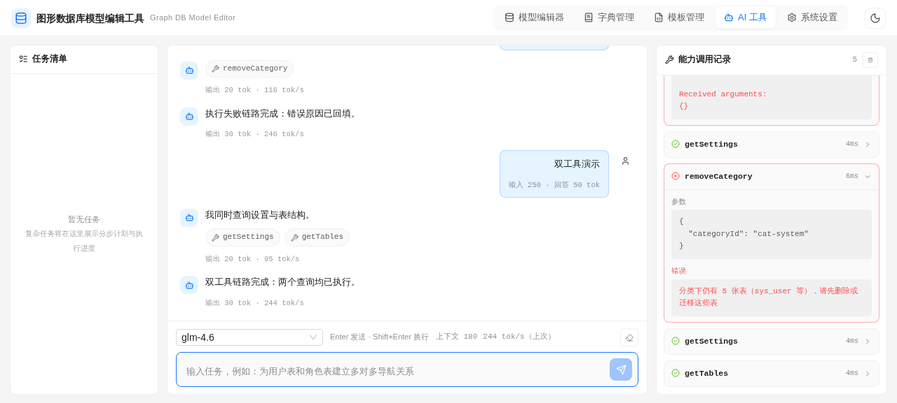
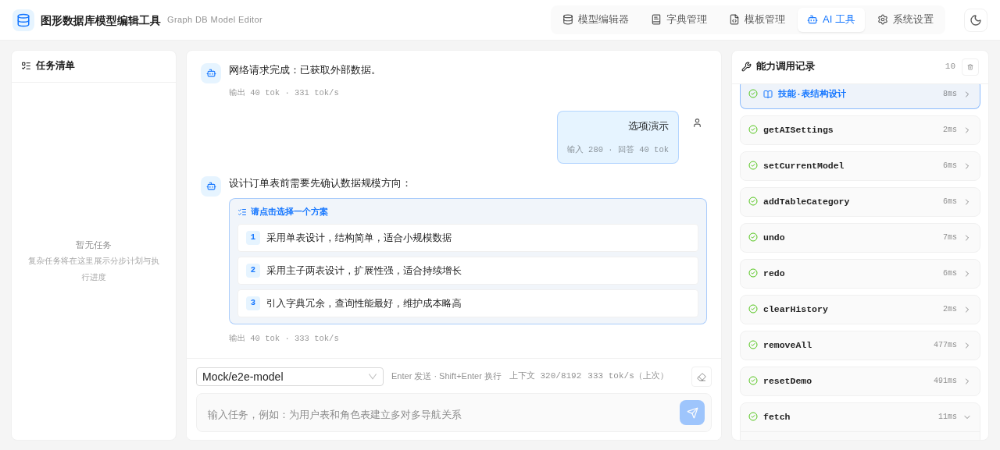
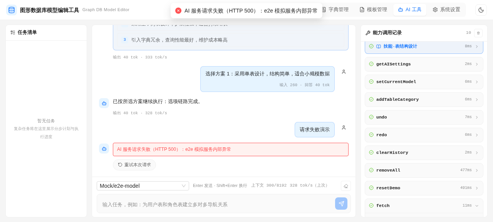
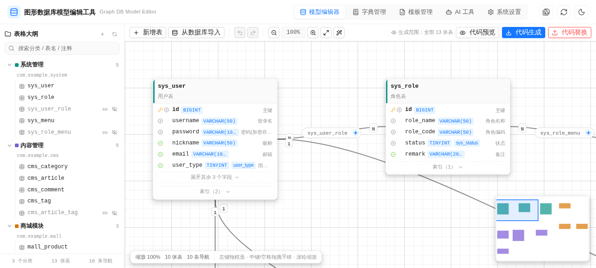

# 图形数据库模型编辑工具

基于 Web 的图形数据库模型编辑工具，支持可视化设计表结构、字段、索引及表间导航关系。提供直观的画布交互、结构化的大纲导航、便捷的编辑功能、数据字典管理与基于模板的代码生成，并支持 CSS 变量自定义主题与亮暗切换。


## 目录

- [快速开始](#快速开始)
- [库构建与宿主接入](#库构建与宿主接入)
- [功能总览](#功能总览)
- [页面封装与数据能力注入（DBManagerView / ManagerApi）](#页面封装与数据能力注入dbmanagerview--managerapi)
- [数据模型概览](#数据模型概览)
- [项目结构](#项目结构)
- [非功能说明](#非功能说明)
- [开发与调试](#开发与调试)
- [常见问题（FAQ）](#常见问题faq)
- [界面截图](#界面截图)

## 技术栈

| 分类      | 选型                                                                                                                                                 |
| --------- | ---------------------------------------------------------------------------------------------------------------------------------------------------- |
| 包管理器  | [bun](https://bun.sh)                                                                                                                                |
| 工具链    | [Vite+](https://viteplus.dev)（`vp` 统一 CLI：dev / build / lint / fmt，`vite-plus` 本地包 + `@voidzero-dev/vite-plus-core` 别名）                   |
| 前端框架  | Vue 3（Composition API + `<script setup>`）                                                                                                          |
| UI 组件库 | antdv-next                                                                                                                                           |
| 图标库    | @lucide/vue                                                                                                                                          |
| 状态管理  | 组件级状态注入（Vue `reactive` + `provide`/`inject`，无 Pinia 依赖）                                                                                 |
| 模板引擎  | Eta（代码生成）                                                                                                                                      |
| 样式      | Sass（scss 标准）                                                                                                                                    |
| 数据能力  | ManagerApi 接口体系（内置 DemoManagerApi 演示实现，可注入自定义实现）                                                                                |
| AI 专属   | AIApi 接口（内置 DemoAIApi：AI 设置 / 三协议对话 / fetch，多供应商多模型）                                                                           |
| AI 内核   | [@earendil-works/pi-agent-core](https://github.com/earendil-works/pi) Agent 运行循环（注入式 StreamFn 复用内置三协议流式客户端，浏览器零 Node 依赖） |
| 代码高亮  | highlight.js + highlights-eta（Eta 模板语法）                                                                                                        |
| 打包下载  | JSZip                                                                                                                                                |

> 页面切换不使用 `vue-router`，通过 `v-if` 状态管理（见 `src/stores/ui.ts`）。

## 快速开始

### 环境要求

| 依赖              | 版本 / 说明                                                                                    |
| ----------------- | ---------------------------------------------------------------------------------------------- |
| bun               | ≥ 1.4.2（`package.json` 的 `devEngines` 约定；检测不满足时按 `onFail: download` 自动引导下载） |
| Vite+ CLI（`vp`） | 全局安装一次即可，安装命令见下                                                                 |
| 浏览器            | 最新版 Chrome / Edge / Firefox                                                                 |

### 安装与启动

前置：全局安装 Vite+ CLI（一次即可）

```bash
# macOS / Linux
curl -fsSL https://vite.plus | bash
# Windows（PowerShell）
irm https://vite.plus/ps1 | iex
```

```bash
# 安装依赖（vp install / bun install 均可）
vp install

# 启动开发服务器（Vite+ 内置命令，读取 vite.config.ts 的 server 配置）
vp dev
# 或经 package.json scripts
bun run dev
```

启动后访问 <http://localhost:3000>（`server.host: 0.0.0.0`、`server.allowedHosts: true` 允许任意 Host / 内网 IP / 预览域名访问）。首次打开会自动加载内置演示数据（3 个分类 / 13 张表 / 10 条导航 / 5 个字典 / 8 个代码模板）。

### 常用命令速查

| 命令                                 | 说明                                                                                                                                                                                                                                                                                                           |
| ------------------------------------ | -------------------------------------------------------------------------------------------------------------------------------------------------------------------------------------------------------------------------------------------------------------------------------------------------------------- |
| `bun run dev`（= `vp dev`）          | 启动开发服务器（localhost:3000，热更新）                                                                                                                                                                                                                                                                       |
| `bun run build`（= `vp build`）      | 库构建：产出 `dist/DBManager.js` + `dist/DBManager.d.ts` 两个文件（CSS 已内联进 JS，详见[库构建与宿主接入](#库构建与宿主接入)）                                                                                                                                                                                |
| `bun run build:pages`                | Pages 演示站构建：应用模式产出 `dist/`（index.html + assets，相对路径 base，见[GitHub Pages 自动发布](#github-pages-自动发布)）                                                                                                                                                                                |
| `bun run preview`                    | 本地预览生产构建                                                                                                                                                                                                                                                                                               |
| `bun run typecheck`                  | 全量类型检查（`vue-tsc --noEmit`）                                                                                                                                                                                                                                                                             |
| `vp check`                           | Vite+ 内置：格式 + lint + 类型检查（staged 提交时自动执行）                                                                                                                                                                                                                                                    |
| `vp install`                         | 安装依赖                                                                                                                                                                                                                                                                                                       |
| `bun scripts/eta-smoke.mjs`          | Eta 模板引擎 API 冒烟测试（模板功能改动前的快速回归）                                                                                                                                                                                                                                                          |
| `bash scripts/e2e/run-all.sh`        | E2E 全套件总入口（顺序执行四域并汇总；dev server 未运行则自起）                                                                                                                                                                                                                                                |
| `bash scripts/e2e/model-elements.sh` | E2E · 模型元素域（56 项断言：画布初态/选择拖拽/新增删除撤销/复制粘贴/自动美化/NN 胶囊/隐藏显示/逻辑删除字段约定链路/SyncTable 固定列与同步滚动）                                                                                                                                                               |
| `bash scripts/e2e/dict-template.sh`  | E2E · 字典与模板域（35 项断言：字典增删与保存/字典分类增删与占用拦截/表模板编辑预览保存删除/字典分类模板）                                                                                                                                                                                                     |
| `bash scripts/e2e/settings.sh`       | E2E · 设置域（43 项断言：分区导航/字段约定持久化/索引类型禁用/AI 多供应商配置与地址协议校验/统一保存/全局规则默认与恢复/旧库单供应商形态迁移/轮数上限）                                                                                                                                                        |
| `bash scripts/e2e/ai-agent.sh`       | E2E · AI 工具链域（135 项断言：pi 内核链路/51 工具注册/历史回放/参数校验重试/错误前缀回填/双工具串行/genCodeZip-genCodeReplace 链路/reload 四工具/AIApi 三协议对话/AI 设置工具/撤销链路/removeAll-resetDemo 危险确认/fetch/点击选项/请求失败重试/思考块贴底三态/技能/任务清单/85% 自动压缩/用量统计/轮数上限） |
| `python3 scripts/check-readme.py`    | README 链接 / 锚点 / 表格自检                                                                                                                                                                                                                                                                                  |
| `bash scripts/package.sh`            | 打包源码为交付 zip（`download/graph-db-model-editor.zip`，含 skills/DBManager 技能文档）                                                                                                                                                                                                                       |

## 库构建与宿主接入

本项目既是可运行的演示应用（`vp dev`），也是一个**可发布的组件库**：`bun run build` 执行库模式构建，最终产物仅两个文件——

| 产物                  | 内容                                                                                                                                               |
| --------------------- | -------------------------------------------------------------------------------------------------------------------------------------------------- |
| `dist/DBManager.js`   | ES 模块单文件（约 2.1 MB，gzip 约 575 KB）：DBManagerView 组件 + 全部状态/工具/演示实现 + pi-agent-core 运行时，CSS 已内联（运行时注入 `<style>`） |
| `dist/DBManager.d.ts` | 滚动合并的类型声明：`DBManagerView` 组件类型 + `ManagerApi` 接口与全部 DTO/VO 类型                                                                 |

构建配置要点（`vite.config.ts`）：

- **外部依赖**（peerDependencies，由宿主项目提供，不打包进产物）：`vue` / `antdv-next` / `@lucide/vue`
- 其余依赖（eta / highlight.js / jszip / markstream-vue / pi-agent-core 及其运行时等）与全部应用代码、组件 scoped 样式、全局样式一并打进 `DBManager.js`
- **动态 import 内联**（`output.inlineDynamicImports`）：markstream-vue 的可选能力（katex / mermaid / mhchem / d2）经 `defineAsyncComponent` 懒加载，不内联会被拆成额外 chunk、与「仅两个交付文件」的库契约冲突（白名单清理会误删被引用 chunk 导致产物损坏）
- 类型经 `vite-plugin-dts`（`bundleTypes`，底层 api-extractor）由 `src/index.ts` 滚动合并为单一声明文件
- CSS 内联由 `scripts/inline-lib-css.mjs` 在 `vp build` 后完成（rolldown 底座下 `vite-plugin-lib-inject-css` 不生效，脚本等效替代并做产物白名单清理）

宿主项目接入方式：

```bash
# 宿主项目需自行安装 peer 依赖
npm i vue antdv-next @lucide/vue
```

```ts
// 宿主入口（自带组件注册与全局样式注入，无需额外 import css）
import { createApp } from "vue";
import Antd from "antdv-next";
import "antdv-next/dist/reset.css";
import { DBManagerView, type ManagerApi, type UpdateTablePosDTO } from "dbmanager-lib";

const myApi: ManagerApi = {
  /* 实现全部异步契约方法（返回 Promise，校验失败 reject 中文提示） */
} as ManagerApi;

createApp(() => h(DBManagerView, { api: myApi }))
  .use(Antd)
  .mount("#app");
```

> 库模式构建后 `dist` 不含演示页 HTML——演示应用通过 `vp dev`（入口 `index.html` → `src/main.ts`）访问；仓库内 `test/host-smoke.html` 为宿主接入冒烟页（直接加载 `dist/DBManager.js` 验证外部依赖解析与样式内联），`test/` 目录已 gitignore。

### GitHub Pages 自动发布

仓库内置 GitHub Actions 工作流（`.github/workflows/deploy-pages.yml`），将演示应用自动发布为 GitHub Pages 站点。工作流参考官方静态站点部署模板（两段式 build + deploy），构建步骤换为本仓库工具链：检出代码 → `oven-sh/setup-bun` 安装 bun → `bun install --frozen-lockfile` → `bun run build:pages` 应用模式构建 → `actions/upload-pages-artifact` 上传 `dist` 产物 → `actions/deploy-pages` 部署。

- **触发**：推送到 `devel` 分支自动触发；亦可在 Actions 页面手动运行（workflow_dispatch）
- **站点地址**：<https://bkbits.github.io/dbm-editor/>（内置 DemoManagerApi 演示数据，无后端依赖，独立可访问）
- **构建配置**：`vite.pages.config.ts`（应用模式，与库模式 `vite.config.ts` 互不影响）；`base: './'` 相对路径使产物可托管于项目页子路径
- **部署来源**：仓库 Pages 需以「GitHub Actions」为构建来源（Settings → Pages → Build and deployment → Source: GitHub Actions）

> 上传动作会自动附带 `.nojekyll`，`assets/` 等资源目录按原样发布；部署队列由 `concurrency: pages` 串行化，进行中的部署不会被新推送打断（排队而非取消）。

## 功能总览

应用由顶栏切换的五个页面组成：**模型编辑器**（画布 + 左侧大纲）、**字典管理**、**模板管理**（代码生成）、**AI 工具**（AGENT 对话式操作）与**系统设置**。以下按功能域逐一说明。

### 画布（模型编辑器）

- **无限画布**：左键拖拽空白处框选（整卡完全被框住才选中，仅交叉不选中；`Ctrl/Shift` 追加）、中键或 `空格+左键` 拖拽平移、滚轮以光标为中心缩放（25% ~ 500%）
- **网格**：间距随缩放联动，线宽恒定 1px 不随缩放变化
- **小地图**：右下角缩略图，点击/拖拽快速定位视口
- **表卡片**：表名/注释/中间表图标 + 字段列表（默认折叠 6 个）+ 索引（默认隐藏）+ 隐藏导航摘要
- **导航线段**：一对一 `-1----1-`、一对多 `-1----N-`、多对一 `-N----1-`、多对多 `-N----N-`；悬停/选中均为实线（悬停较细且半透明，选中加粗 + 光晕，二者可区分）、悬停提示单行展示「属性 ⇄ 属性（关系说明）」、双击编辑、右键菜单
- **卡片 ⇄ 导航线联动**：悬停卡片时其关联导航线（含 NN 经由的中间表）联动切换到悬停风格；选中卡片（单选/多选/框选）时关联线联动切换到选中风格（加粗 + 光晕）；表选中与线段选中互斥，画布同一时刻只有一种选中焦点
- **悬停/选中过渡**：卡片阴影、连接点淡入缩放、隐藏按钮淡入、导航线颜色/粗细/光晕、标记描边、NN 胶囊、右键菜单弹出等全部带平滑过渡动画
- **多对多中间表**：默认完全隐藏（`Table.hidden` 随模型数据持久化，刷新/重开后保持），线上显示 `中间表名 +` 胶囊，点击展开（若中间表落在当前视口外，画布会平滑滚动将其带入视野，保证展开后一定看得见）；左侧大纲眼睛恢复显示同样带视野保障；对中间表执行隐藏则彻底隐藏（非透明）
- **任一端表隐藏**：导航线不渲染，改为在可见端卡片底部显示「隐藏导航摘要」（类型 + 关联表名）
- **自动美化**：工具栏「魔法棒」按钮 / 空白右键菜单「自动美化布局」，以导航关系为边做力导向布局自动规划每个表卡片的位置（相关联的表彼此靠近、孤立表散开不重叠，结果按 20px 网格对齐），卡片平滑滑动到新位置并自动适应画布
- **对齐与分布**：选中 ≥ 2 张表后，卡片右键 / 空白右键菜单出现「对齐与分布」分组——左对齐/右对齐/顶部对齐/底部对齐（边缘对齐）、水平对齐/垂直对齐（中心线对齐）、水平/垂直均匀分布（首尾不动等间距，需 ≥ 3 张）
- **拖拽创建导航**：卡片上下左右四个连接点拖至目标表；两表间已有导航时丢弃并提示
- **右键菜单**：卡片（编辑/复制/隐藏/对齐分布/删除）、线段（编辑/删除）、空白（新增表/粘贴/自动美化/适应画布/重置缩放/对齐分布）
- **保存与刷新**：顶栏「保存所有」按钮（走 `ManagerApi.save()` 全量保存契约，全局快捷键 `Ctrl+S` 同效）与「刷新」按钮（走 `ManagerApi.load()` 重新加载模型，放弃本地未保存状态并清空撤销栈）；多选表卡片拖动结束时仅调用一次 `updateTablePos` 批量保存位置

**画布快捷键**（`Ctrl+S` 为全局快捷键，任意页面生效）：

| 快捷键                    | 作用                            |
| ------------------------- | ------------------------------- |
| `Ctrl+Z`                  | 撤销                            |
| `Ctrl+Shift+Z` / `Ctrl+Y` | 重做                            |
| `Ctrl+C` / `Ctrl+V`       | 复制 / 粘贴选中表               |
| `Ctrl+A`                  | 全选所有表卡片（不含隐藏表）    |
| `Ctrl+D`                  | 取消选中                        |
| `Ctrl+S`（全局）          | 保存所有（`ManagerApi.save()`） |
| `Delete`                  | 删除选中表                      |
| `Esc`                     | 取消选择                        |
| 中键拖拽 / `空格 + 左键`  | 平移画布                        |
| 滚轮                      | 以光标为中心缩放                |

### 左侧表格大纲

- 分类树（名称 / 包路径 / 表数量），选中高亮、可折叠、支持增删改
- 表名点击 → 画布卡片联动高亮并平滑居中；画布卡片点击 → 大纲联动高亮
- 隐藏表在大纲中以闭眼图标标识，可一键显示/隐藏
- 面板底部「重置演示数据」按钮：将库内嵌种子数据（模型元素 / 字典 / 模板）经全量替换契约（`save` / `saveDicts` / `saveTemplates`）落盘并重载各仓库（设置与 AI 设置不受影响；AI 的 `resetDemo` 工具同源）

### 编辑对话框

- **表编辑**：双击卡片/大纲表名或右键菜单触发；**第一个字段固定为主键**（依「系统设置 → 字段约定」约定生成，不可修改、不可排序、不可删除，每表强制拥有；打开旧表时自动归一——同名字段上移到首行并对齐约定属性，缺失则补建）；字段（增删改/拖拽手柄排序/类型自动映射 Java 类型/字典关联/逻辑删标记）、**审计字段一键增删**（「添加审计字段」按设置约定补齐 create_by/create_time/update_by/update_time（Java 属性名自动转小驼峰 createBy 等），已存在的同名字段跳过；「删除审计字段」整组移除）、**逻辑删除字段**（「逻辑删」列勾选标记软删除字段，**每表至多一个**——勾选新的会自动转移标记并提示；「添加逻辑删除字段」按设置约定一键补齐（同名字段存在则直接复用打标记），「删除逻辑字段」直接整列移除该字段）、索引（类型下拉选项来自「系统设置 → 索引类型」）、导航列表（跳转编辑/删除）；字段表格为**多 table 同步滚动结构**（表头一张表、表体左固定列/中间列/右固定列各一张表，`.st-scrollbar-h/-v` 两条专用滚动条为唯一滚动源——不承载内容仅以 sizer 撑出滚动尺寸，滚动事件统一写入各壳：表头壳只同步横向、表体壳横纵皆同步；ResizeObserver 重算布局，列宽按「显式宽度直接采用 / 弹性列以 minWidth 为下限均分剩余空间（除不尽前几列各多 1px）」分配；窄视口下排序/字段名列恒在左侧、删除按钮恒在右侧，固定列与滚动内容分属不同 DOM 树，结构性杜绝透出/遮挡）
- **导航编辑**：四种类型、两端关联属性、属性名、级联操作（自动/无动作/删除/设为Null，双向独立配置）、NN 中间表（自动创建或选择已有表）、一键反转方向
- **从数据库导入**：经 `ManagerApi.importFromDB()` 读取库表结构（含索引），勾选导入；字段 Java 类型默认值由「系统设置 → 列默认类型」规则依序正则匹配推导（悬停可预览各字段与索引归一化结果），未命中回退内置类型映射；导入的索引类型不在设置列表时归一为列表首项

### 字典管理

- **字典分类**（与表分类同构）：分类属性为「分类名称 + 基础包路径 basePackage + 类名称 className」（后两者即字典代码生成的包名/类名依据，类名称强制大驼峰，小驼峰/下划线输入失焦自动转换）；列表按分类分组展示（组头可折叠，悬停显示编辑/删除按钮与默认产物路径），未分类字典归入末尾「未分类」组；分类下仍有字典时拒绝删除
- 字典（键/标签/注释/所属分类）与字典值（值键/常量属性名/标签/类型/注释/自定义颜色）完整 CRUD；常量属性名（propertyName）为字典代码生成时的常量名，仅允许全大写，小写输入即时自动转大写
- 值类型 `I/S/W/D` 对应 Info/Success/Warning/Danger 风格色，自定义颜色优先
- 模糊搜索覆盖字典键、标签、注释及值的键、标签、注释，命中自动跳转并高亮
- 切换页面后返回时保留选中字典与编辑内容（页面 v-if 卸载重挂后自动恢复）
- 字段编辑时可关联字典键，卡片字段行显示字典小徽标

### 模板管理与代码生成

- **表模板**（每表渲染一次）：模板列表 + 实时编辑预览：左侧模板脚本（Eta 语法高亮编辑器，`<% %> / <%= %> / <%~ %>` 标签与 `<%# %>` 注释区分着色，输入实时同步）、右侧选择目标表实时渲染
- **字典分类模板**（仅一个，每分类渲染一次）：左侧列表独立分组展示，选中后编辑区切换为字典模板模式（无增删），右侧预览目标改为字典分类（产物含该分类下全部字典与值）；默认种子 `dict` 模板按分类属性生成 Java 字典常量类（产物路径 `src/main/java/<基础包路径>/<类名>.java`，如 `SysDictConstants.java`；常量值统一为 `String` 类型，常量名取字典值的常量属性名 propertyName，缺省由值键推导大写蛇形）
- **代码预览**：选中单表 → 切换模板标签页查看生成代码（highlight.js 高亮、可复制；模板标记丢弃时显示 aborted 提示）
- **代码生成**：选中分类 / 选中表 / 不选中（全部）→ 弹出模板选择框（默认全选，可勾选本次参与的模板；附「生成字典分类模板代码」开关，默认开启——开启时每个字典分类追加渲染一份字典产物）→ 触发下载 zip（JSZip 按模板内 `filePath` 建目录；表级「启用模板」与模板 `aborted` 一并生效）
- **代码替换**：同上范围与开关 → 弹出模板选择框 → 确认（含文件清单）→ 经 `ManagerApi.replace(zip)` 上传 zip（结果反馈由 api 实现自行处理）

模板内置变量与工具：

```ts
interface TableTemplateContext {
  // 表模板渲染上下文（每表渲染一次）
  templateName: string; // 模板名称
  templateContent: string; // 模板内容
  result?: string; // 生成结果
  basePackage: string; // 基础包名（表所属分类）
  fileName: string; // 文件名（模板内赋值）
  filePath: string; // 文件路径（模板内赋值）
  language?: string; // 显式指定预览高亮语言（模板内赋值，如 <% context.language = 'java' %>）
  table: TableVO; // 当前表（columns/indexes/navigates/options/templates）
  settings: Settings; // 应用设置（作者 author 与表/列选项元定义，供 javadoc 与选项分支）
  aborted: boolean; // 丢弃本次生成（默认 false；置 true 则该产物不打包进 zip）
  hasColumn(columnName: string): boolean; // 按数据库列名判断列是否存在
  getColumn(columnName: string): TableColumn | undefined; // 按数据库列名获取列
}
```

> 预览/代码生成结果的高亮语言：`context.language` 显式指定优先（如 `java` / `sql` / `xml` / `javascript`），未设置时按产物文件名后缀自动识别，工具栏语言徽标实时显示实际生效语言。

| 工具                                            | 说明                                                                                        |
| ----------------------------------------------- | ------------------------------------------------------------------------------------------- |
| `utils.toCamelCase(str, firstLetterLowerCase?)` | 转驼峰                                                                                      |
| `utils.toSnakeCase(str)`                        | 转蛇形                                                                                      |
| `utils.getJavaType(column)`                     | 数据库类型映射 Java 类型                                                                    |
| `utils.quote(content, condition?)`              | 引号包裹                                                                                    |
| `utils.wrap(content, condition?)`               | 括号包裹                                                                                    |
| `utils.isEmpty(str)` / `utils.isBlank(str)`     | 判空 / 判空白                                                                               |
| `utils.nowDateTime()`                           | 当前时间（yyyy-MM-dd HH:mm:ss，javadoc @since）                                             |
| `utils.optionEnabled(options, name)`            | 读表/列选项是否启用（缺省视为启用），如 `utils.optionEnabled(context.table.options, "add")` |

Eta 语法：`<% %>` 逻辑、`<%= %>` 输出、`<%# %>` 自定义注释标签（渲染前剥离）。模板内可直接访问 `context` 与 `utils` 顶层标识（`useWith` 模式）。

内置 8 个模板（solon3 + easy-query + satoken + antdv-next + MySQL 技术栈；java 模板类与方法均带 javadoc `@author`/`@since`，方法与端点按表选项选择性生成，`add`/`update` 等写选项全关时 mapper/service 整模板丢弃）：

| 模板          | 产物                                                                                                                                                                                                                                                                                                                                                                                                               | 技术栈适配            |
| ------------- | ------------------------------------------------------------------------------------------------------------------------------------------------------------------------------------------------------------------------------------------------------------------------------------------------------------------------------------------------------------------------------------------------------------------ | --------------------- |
| `entity`      | `entity/Xxx.java`（`@Table` 常驻（命名直转时省略参数）、`@Column` 命名直转时省略、主键 `primaryKey = true`、`@FieldNameConstants`、`@EntityProxy` + `implements ProxyEntityAvailable<Xxx, XxxProxy>`（代理位于 `entity/proxy` 子包）、swagger2 `@ApiModel`/`@ApiModelProperty`（含导航属性）、`@Navigate` 导航（`Fields` 常量）、`ICreate`/`IUpdate`/`IGenId`/`IDeptId` 按列自动实现、树形表 `parent`/`children`） | easy-query + swagger2 |
| `mapper`      | `mapper/XxxMapper.java`（MapStruct `@Mapper` + 静态单例 `INSTANCE`，`toEntity(XxxAddDTO)` / `toEntity(XxxUpdateDTO)` 按 add/update 选项生成）                                                                                                                                                                                                                                                                      | map-struct            |
| `service`     | `service/XxxService.java`（接口：`getById`/`add`/`update`/`remove`/`batchRemove` 按表选项生成，`@Nullable`/`@NotNull` 注解）                                                                                                                                                                                                                                                                                       | solon3 + easy-query   |
| `serviceImpl` | `service/impl/XxxServiceImpl.java`（`@Component` + `@Inject` `EasyQuery`）                                                                                                                                                                                                                                                                                                                                         | solon3 + easy-query   |
| `controller`  | `controller/XxxController.java`（`@Controller` + `@Mapping("/api/模块/功能")` + `@SaCheckPermission("模块.功能.操作")`——表名按首下划线拆分（`sys_user` → `sys/user`、`sys.user.add`）；`info`/`list`/`add`/`edit`/`del`/`batchDel` 按表选项生成，`list` 查询条件按列选项（`query`）与类型生成——时间列 `rangeClosed`（起止双参数闭区间）、id/关联字典列 `eq` 精准匹配、字符串列 `like` 模糊匹配、其余数值 `eq`）    | solon3 + satoken      |
| `vue`         | `views/xxx/Xxx.vue`（`a-table` 列表 + `a-modal` 表单；列表列按列选项 `show`、表单字段按 `add`/`update`、按钮按表选项生成）                                                                                                                                                                                                                                                                                         | antdv-next            |
| `sql`         | `sql/表名.sql`（utf8mb4 建表 DDL，含索引与主键）                                                                                                                                                                                                                                                                                                                                                                   | MySQL                 |
| `menuSql`     | `sql/表名_menu.sql`（`sys_menu` 菜单 + 按钮权限按表选项生成，权限码与 Controller 一致）                                                                                                                                                                                                                                                                                                                            | MySQL                 |

可在「模板管理」中自由修改与新增；Controller 的权限码（`模块.功能.操作`，如 `sys.user.add`）与 menuSql 生成的按钮权限一一对应，vue 模板的请求路径与 Controller 的 `@Mapping("/api/模块/功能")` 路由一致。生成产物格式保证：最后一条 `import` 与后续代码之间自动空一行。

### 系统设置

- **分区导航与固定保存条**：页面左侧为设置项导航（列默认类型 / 索引类型 / 字段约定 / 代码生成 / AI），点击平滑滚动到对应分区，滚动内容时自动高亮当前分区；底部「保存设置 / 放弃修改」操作栏固定在页面底部，不随内容滚动
- **列默认类型**：从数据库导入时的 Java 类型默认映射。对字段的数据库类型（如 `VARCHAR(255)`、`Decimal(6, 4)`）按规则列表**自上而下依次**（`sort` 升序，越小越优先）进行正则表达式匹配（忽略大小写），取**第一条命中**规则的 Java 类型作为默认值；全部未命中时回退内置类型映射表
- 可选 Java 类型：`Character` / `String` / `Long` / `Integer` / `Float` / `Double` / `BigDecimal` / `LocalDateTime` / `LocalDate` / `LocalTime` / `Timestamp`
- 规则顺序即优先级，拖拽手柄调整（保存时按序重编号 `sort`）；非法正则即时标红并禁用保存；内置「规则测试」输入任意数据库类型实时预览命中结果（含未保存修改，区分「生效/命中被抢先」）
- **索引类型**：索引类型列表管理（增删，自动转大写、去重校验）。「编辑表」对话框的索引类型下拉选项与数据库导入的索引类型归一化均使用该列表；至少保留一个类型
- **字段约定（主键 / 审计 / 逻辑删除）**：主键字段约定（默认 `id` / `BIGINT`，每表强制拥有且固定为第一个字段，不可修改、不可排序，Java 类型按「列默认类型」规则自动推导）、审计字段约定（创建人 `create_by` / 创建时间 `create_time` 强制非空，更新人 `update_by` / 更新时间 `update_time` 可空；创建/更新人默认 `BIGINT`，创建/更新时间默认 `DATETIME`；数据库蛇形命名，Java 属性名自动转小驼峰）与**逻辑删除字段约定**（默认 `deleted` / `TINYINT`，软删除标记字段，每表至多一个，强制非空）。名称与类型均可编辑（类型可自动补全）；审计与逻辑删除字段可单独设定 Java 类型（可自动补全、可清空，**留空 = 按「列默认类型」规则自动推导且随类型联动**，设定后建列固定使用该值；主键 Java 类型始终为自动推导），需为合法标识符且六个名称互不重复；非空约束为固定语义随字段角色而定；「恢复默认」一键回置 id/create_by/create_time/update_by/update_time/deleted（Java 类型全部回到自动推导）；「编辑表」对话框据此固定主键首字段并提供审计与逻辑删除字段一键增删（建列时取约定的 Java 类型）
- **代码生成**：作者（生成 javadoc 的 `@author`，留空则省略该标签）与表/列选项元定义（名称/类型/标签/说明/字典）。默认表选项为 `query`/`add`/`update`/`remove`（驱动 mapper/service/controller 分支），默认列选项为 `show`/`query`/`add`/`update`/`remove`（驱动 controller 查询条件与 vue 列表/表单）；选项类型支持 `boolean`/`string`/`int`/`long`/`double` 及自定义，名称需为合法标识符且列表内唯一
- **AI（多供应商 / 多模型）**：供应商列表——每张供应商卡片含名称（空则自动命名「供应商N」）、**对话协议**（`OpenAI Chat Completions` / `OpenAI Responses` / `Anthropic Messages` 三选一）、服务地址（openai 系必须以 `/v1` 结尾，如 `https://api.example.com/v1`；anthropic 兼容带或不带 `/v1`）与 API Key（openai 系 Bearer 鉴权、anthropic 系 `x-api-key`，本地服务可留空），以及该供应商下的**模型列表**（模型 id / 展示名称 / 是否支持思考 / 思考强度 `low|medium|high|xhigh|max` / 输入输出上下文长度，模型 id 供应商内唯一、可跨供应商重名——模型唯一标识为「供应商 id + 模型 id」二元组）；**默认模型**（`供应商名/模型名` 形态展示，AI 工具页启动时选中的模型，会话内切换不写回设置）；工具调用轮数上限（默认 50，范围 1-500，达到上限自动中止防失控）；全局规则（多行文本，非空时作为规则文本附加在 AI 工具每次调用的系统提示中；**新库默认带任务流程约定文本**——七步任务流程（读取设置 → 刷新重载 → 分析需求 → 制定队列清单 → 按清单执行 → 刷新校验 → 校验结果）与三条遵守规则（技能层层递进加载 / 一轮工具调用只更新一个元素 / 大量增删分批实施），「恢复默认」一键找回）。AI 设置经独立契约 `AIApi`（`getAISettings` / `setAISettings`）读写，保存/放弃随整页底部操作栏**统一驱动**（AI 草稿独立校验，无效时连同提示一并禁用保存；已保存的空规则不会被种子默认覆盖，尊重主动清空）；旧库单供应商形态读取时自动迁移为一个默认供应商
- 设置保存后持久化（DemoManagerApi + localStorage），整页统一保存 / 放弃修改（含 AI 区块，两部分契约先后落盘）

### AI 工具（AGENT 对话式操作）

顶栏「AI 工具」进入 AGENT 对话界面，用自然语言直接操作模型数据与代码生成：

- **能力装载（51 工具）**：按域分层的 AGENT 工具集——模型元素基础操作（`reload` / `saveAll` / `undo` / `undoAll` / `redo` / `clearHistory` / `resetDemo` / `removeAll`）、表分类（`getTableCategories` / `addTableCategory` / `updateTableCategory` / `removeTableCategory`）、表（`getTables` / `getTable` / `addTable` / `updateTable` / `removeTable` / `updateTablePos` / `importTablesFromDB`）、导航（`getNavigates` / `addNavigate` / `updateNavigate` / `removeNavigate`）、字典（`reloadDicts` / `saveDicts` / `getDictCategories` / `getDicts` / `getDict` / `addDict` / `updateDict` / `removeDict`）、模板（`reloadTemplates` / `saveTemplates` / `getTemplates` / `getTemplate` / `getDictTemplate` / `addTemplate` / `updateTemplate` / `removeTemplate`）、代码生成三件套（`genCode` 单模板单表返回内容 / `genCodeZip` 打包 zip 供下载 / `genCodeReplace` 写回源码）、设置（`getSettings` / `setSettings` / `reloadSettings`）、AI 设置（`getAISettings` / `setAISettings` / `reloadAISettings` / `setCurrentModel`）、扩展（`fetch` 网络请求 / `skill` 技能加载）。按「流式输出 → 工具调用 → 结果回填 → 继续生成」循环直至最终回答（轮数上限为 AI 设置项，默认 50，范围 1-500，防失控）
- **工具分层原则**：读类工具仅读各仓库的运行时状态（不调接口）；写类工具（新增 / 更新 / 删除 / 保存）一律「本地先行 + 契约落盘 + 同步运行时状态」——复用各仓库既有的「本地先行 → await api → 失败回滚」事务方法，界面与 AI 走同一条路径、状态天然一致，**会话结束无需按域刷新**；刷新职责只落在 `reload` / `reloadDicts` / `reloadTemplates` / `reloadSettings` 四个读类工具上（UI 顶栏「刷新」按钮 = 四工具依次执行的等价语义）；危险操作（`resetDemo` / `removeAll` / `genCodeReplace`）先经前端弹窗确认
- **AGENT 运行内核（pi-agent-core）**：「模型流式 → 工具调用 → 结果回填 → 继续生成」循环由 [`@earendil-works/pi-agent-core`](https://github.com/earendil-works/pi) 的 `Agent` 驱动（`src/ai/pi-agent.ts` 适配层）：网络层注入自定义 `StreamFn`——把 AIApi 三协议客户端的归一增量（鉴权、CORS、错误文案不变）翻译为 pi AssistantMessageEvent 事件协议，pi 自带的 openai/anthropic/google SDK 为 Node 端懒加载实现、浏览器不可用，注入式 StreamFn 是官方推荐的接入方式；供应商连接信息在 send 时确定后闭包捕获（会话期间模型与供应商固定）；工具注册表经 typebox `Type.Unsafe` 零改造包原始 JSON Schema（入参先经 pi 校验与类型矫正，缺必填参数转英文 `Validation failed` 错误结果回填重试，执行失败加「工具执行失败：」前缀回填）；会话历史（含 compact 边界）每次发送重建为 pi transcript 种子，事件流（message_update / tool_execution / turn_end）镜像到界面会话态；同轮多工具串行执行
- **默认规则**：系统提示内置任务执行流程（① 读取最新设置与数据作为任务上下文参考，修改任何元素前先读取其当前值，避免给予脏数据执行任务；② 有不明确之处先按「选项模板」提供可选项让用户选择；③ 复杂任务先创建分步任务计划并按模板汇报，涉及特定领域先加载对应技能；④ 按计划执行；⑤ 按需校验执行结果）与必须遵守的规则（树形表不自关联导航而用 `parentIdColumn`；每表开头必须主键 id 字段；按需添加审计字段/逻辑删除字段（每表至多一个）/索引；字段尽量非空；按需关联字典；字典值键不用数字而用代表含义的首字母大写）
- **全局规则**：AI 设置中的全局规则非空时附加在系统提示中（优先级最高）；新库默认带任务流程约定文本（`src/ai/defaults.ts`，设置页可一键恢复默认，旧库已保存值含主动清空不受影响）
- **内置技能库**：六个领域技能（`table-design` 表结构设计 / `navigate` 导航关系 / `dict` 字典设计 / `codegen` 代码生成与替换 / `import-db` 数据库导入 / `canvas-layout` 画布布局），按「部分」组织（如主键与约定字段、级联策略选择）；模型通过 `skill(skill, parts?)` 工具按需加载（单独占用一轮工具调用，只加载相关部分可节省上下文）；聊天区与右侧记录以独立蓝色书本样式展示加载了哪个技能的哪些部分
- **任务清单**：系统提示内置「汇报 / 同步」任务清单消息模板，复杂任务先分步规划并汇报，状态变化随时同步；界面解析模板驱动左侧任务面板（执行中 / 未开始 / 已完成 / 暂停四态醒目样式：状态色条 + 徽标 + 汇总芯片，流式期间实时刷新）；用户中止时执行中任务自动转暂停，下一轮发送把暂停中的任务同步给模型继续完成；模板块从助手正文中剥离，不在正文重复展示
- **点击选项**：系统提示内置「选项模板」（`【选项】` 块 + 编号方案），模型需要用户决策时输出，界面解析为消息下方的可点击按钮（序号角标 + 方案描述，含 Markdown 强调清洗）；点击即把「选择方案 N：描述」作为下一条用户消息发送，免手打；仅最后一条消息且空闲时可点击，转入历史后按钮转静态展示（可读不可再点，头部文案随之切换）；选项块从正文中剥离，与任务清单同构（流式半写头也剔除防闪烁）
- **请求失败重试**：某次问答请求失败（网络 / HTTP 错误 / 轮数上限中止）时，最后一条错误消息提供「重试本次请求」按钮——点击后移除该次失败的交换（配对问题消息 + 期间全部助手轮次，等价于失败从未发生）并按原问题重新发送；失败轮次里已执行的写类工具效果与调用记录保留（append-only）；未配置 AI 服务的配置型提示不提供重试；运行结束才渲染的按钮经运行态联动补滚，不会被折叠线裁切
- **上下文自动压缩**：已用上下文达模型输入上下文长度的 85% 时，在轮边界自动发起压缩请求（历史序列化为带截断上限的文本，保留任务目标 / 已完成操作 / 任务清单状态 / 待办），历史折叠为摘要后以摘要为基座继续对话；聊天区以居中分隔条提示「上下文已自动压缩」（悬浮可查看摘要），压缩后至少新增 4 条消息才允许再次压缩；占用超 80% 警告色、达 85% 强调色提示
- **界面布局**：左侧为当前任务清单，中间上方为历史聊天数据，下方为文本输入框（Enter 发送 / Shift+Enter 换行，可随时停止生成、开启新会话）；右侧为能力调用记录（默认收起，点击展开查看参数与返回值；记录过多时不挤压变形，面板原本贴底时新记录自动跟随滚到底部；可单独清空，不影响对话）
- **思考内容**：模型支持思考时，思考流以可收缩块展示（铺满消息体宽度）——正在输出时自动展开、完成后自动收起，亦可手动切换；块内停留在底部时新内容追加自动跟随滚到底部（高频分片下以程序滚动位置判定用户意图，避免滚动事件竞态误停跟），上翻查看即停跟、回底恢复
- **token 用量统计**：输入区状态条展示上下文占用（已用 / 模型输入上下文长度）与输出速度（任务中实时估算、usage 到达后真实值收口，停止后显示上一次任务速度）；user 消息标注该问题累计输入 / 回答 token，assistant 消息标注本轮输出与速度
- **消息渲染**：助手正文用 [markstream-vue](https://markstream.simonhe.me/zh/) 做流式 Markdown 渲染（`mode="chat"` 平滑出字，标题 / 列表 / 加粗 / 行内代码 / 围栏代码块 / 表格 / 引用，代码块配色与主题令牌对接，随亮暗主题切换）；助手消息附工具调用芯片，点击定位右侧对应记录；展示文本（正文 / 思考 / 调用参数与返回）均去头尾空白
- **模型选择与多协议对话**：输入区模型下拉显示为「供应商名/模型名」，运行时切换（不持久化，重启回落设置中的默认模型）；对话按当前供应商的协议分派到 OpenAI Chat Completions（`{base}/chat/completions`）/ OpenAI Responses（`{base}/responses`）/ Anthropic Messages（`{base}/v1/messages` 或 `{base}/messages`），三协议的流式增量（正文 / 思考 / 工具调用 / 用量）归一到同一套增量契约，AI 设置工具可切换运行时模型（`setCurrentModel`）
- **代码生成产物下载**：`genCodeZip` 生成后自动打包 zip 并缓存 Blob，调用记录行提供下载按钮（收起态迷你图标 / 展开态完整文件名与大小），会话内可重复点击下载；`genCode` 为单模板单表生成并直接返回代码内容
- **代码替换确认**：`genCodeReplace` 触发时先弹出待覆盖文件清单（文件名 / 路径 / 表 / 模板 / 大小），用户「确认替换」后才写回，取消则向模型返回未执行；`resetDemo` / `removeAll` 同样先弹危险操作确认框（确认后才执行）
- **运行时同步**：写类工具经各仓库「本地先行 + 契约落盘」方法直接同步运行时状态，画布与各页面即时一致；撤销 / 重做 / 清空历史等基础操作工具与画布快捷键（Ctrl+Z / Ctrl+Y）同源
- **上下文防溢出**：工具结果回填模型上限 48k 字符（超限截断标注）；代码生成可选用 `includeContent` 附带文件内容（单文件 6k 截断）

### 主题

- 全部颜色/间距/圆角/阴影通过 CSS 变量定义（`src/styles/variables.scss`），统一携带 `--dbm-` 前缀（与宿主项目变量隔离），可在外部覆盖定制主题；无 antd 对应物的令牌（画布网格线、代码高亮配色、分类色板 `--dbm-cat-*`、布局尺寸）直接覆盖 `--dbm-*` 变量即可
- `src/styles/antd-theme.scss` 为 **antd 主题同步层**：把可映射的 `--dbm-*` 令牌重定义为 antdv-next 的 `--ant-*` CSS 变量（内部 a-config-provider 已开 `theme.cssVar`），组件外观跟随宿主 antd 主题（品牌色、令牌覆盖、暗色算法）自动联动；此类令牌请通过宿主 antd 主题配置，而非覆盖 `--dbm-*`
- 顶栏按钮切换亮色/暗色，同步根元素 `data-theme`，CSS 变量与 antdv-next 主题算法自动切换，偏好持久化

### 响应式与移动端适配（≤768px）

页面在窄屏（手机/平板竖屏）自动切换移动端布局，桌面布局不受影响（断点 768px，媒体查询驱动）：

| 区域     | 移动端行为                                                                                                                                                                                        |
| -------- | ------------------------------------------------------------------------------------------------------------------------------------------------------------------------------------------------- |
| 顶栏     | 品牌标题与英文副标题隐藏，导航改图标态（含 title/aria-label），功能按钮缩至 28px                                                                                                                  |
| 表格大纲 | 侧边栏转为滑入抽屉：画布左上角悬浮开关（带遮罩），选中表后自动收起，窄屏转宽屏自动复位                                                                                                            |
| 画布     | 全宽触控拖拽（pointer 事件 + `touch-action: none`），小地图隐藏，工具栏换行布局（生成范围文字隐藏）                                                                                               |
| 触屏手势 | 画布触屏专用手势：单指平移、双指缩放（锚定双指中点，含双指拖动平移）、双击卡片编辑、长按 480ms 打开右键菜单（卡片/连线/空白分流）；连接点命中区扩至 28px，状态栏操作提示随 `pointer: coarse` 切换 |
| 字典管理 | 左右分栏改上下堆叠（列表 32vh 限高）；字典值六列表格改双列卡片（注释整行、表头隐藏，输入自带占位）                                                                                                |
| 模板管理 | 列表转顶部条区（26vh），编辑/预览单列堆叠；代码区横向滚动，高亮层同步滚动；帮助面板可折叠（默认收起，展开限高 40vh 滚动）                                                                         |
| 系统设置 | 紧凑内边距；规则表格隐藏序号列、正则/类型列收缩                                                                                                                                                   |
| 对话框   | 宽度改 `min(设计宽, 94vw)` 响应式钳制，内容体超高滚动；字段/索引多列表格保持列结构整体横向滚动（表头与行同滚）                                                                                    |
| 触屏细节 | 弹层惯性滚动（`-webkit-overflow-scrolling: touch`）、行内操作按钮常显（不依赖 hover）、点按目标 ≥24px；触屏无 hover，选中卡片即显示连接点与隐藏按钮，多选改经长按菜单「全选表」                   |

## 页面封装与数据能力注入（DBManagerView / ManagerApi）

整个应用页面封装为 `src/views/DBManagerView.vue`，可通过属性注入自定义数据能力实现：

```ts
import DBManagerView from '@/views/DBManagerView.vue'
import type { ManagerApi } from '@/types/manager'
import type { AIApi } from '@/types/ai'

const myApi: ManagerApi = {
  // 实现全部异步方法（均返回 Promise）：设置读写 / 数据库导入 /
  // 模型加载与全量保存 / 表分类・表・导航细粒度 CRUD / 字典与模板
  // CRUD / 代码替换（详见 src/types/manager.ts 的 ManagerApi 接口）
  ...
}

const myAIApi: AIApi = {
  // AI 专属能力（可选注入，缺省使用内置 DemoAIApi）：AI 设置读写 /
  // 三协议对话（openai-chat / openai-responses / anthropic）/ fetch
  // （详见 src/types/ai.ts 的 AIApi 接口）
  ...
}
```

```vue
<DBManagerView :api="myApi" :ai-api="myAIApi" />
<!-- 不传 api 时使用内置 DemoManagerApi 演示实现（内存 + localStorage）；
     不传 aiApi 时使用内置 DemoAIApi -->
```

注入链路：

- **DBManagerView** 解析 `api` / `aiApi` 属性（缺省共享 `sharedDemoApi` / `sharedDemoAIApi` 单例）后做两件事：`provide` 注入子组件（`useManagerApi()` / `useAIApi()` 取用响应式引用）；调用 `createDBManagerState(() => api, () => aiApi)` 创建整套状态仓库并 `provide` 注入子树——**每个 DBManagerView 实例一套状态**，不依赖 Pinia 等应用级全局单例
- **状态仓库**（`src/stores/`）：theme / ui / model / canvas / dict / template / settings / history / ai 九个仓库均为 Vue `reactive` 对象（state 字段 + getter 访问器 + action 方法），子组件经 `useXxxStore()` 注入取用（函数名与早期 Pinia 版本一致）；仓库间相互引用与 api 读取均经工厂入参的惰性取值函数建立，切换 api 时 DBManagerView 自动全量重载各仓库数据
- **子组件**（如数据库导入 / 代码替换对话框）通过 `useManagerApi()`（`src/api/manager-api.ts`）注入响应式引用，在合适位置 `await` 调用 `api.importFromDB()` / `api.replace(zip)` 等异步方法；AI 专属能力经 `useAIApi()`（`src/api/ai-api.ts`）取用
- **模型变更**遵循细粒度异步契约——每次操作先改本地状态，再 `await` 对应 api 方法（`addTable` / `updateTable` / `removeTable` / `updateTablePos` / `addNavigate` …）即时持久化，持久化失败（reject）自动回滚快照；撤销/重做恢复后经 `saveAll`（`api.save` 全量替换契约）把撤销后的完整状态落盘

### ManagerApi 接口清单

全部方法均为**异步契约**（返回 `Promise`，校验失败 reject 中文业务提示），UI 侧统一 `await` 消费，对接真实后端（HTTP / IPC / 文件 IO）时无需再调整调用链路：

| 方法                                                                                  | 说明                                                                                                                                                     |
| ------------------------------------------------------------------------------------- | -------------------------------------------------------------------------------------------------------------------------------------------------------- |
| `getSettings() / setSettings(settings)`                                               | 应用设置读写（索引类型列表 + 列类型映射规则 + 代码生成配置：作者 / 表选项 / 列选项元定义）                                                               |
| `importFromDB()`                                                                      | 从真实数据库读取表结构（含字段与索引，用于导入建模）                                                                                                     |
| `load()`                                                                              | 加载完整模型元素（分类/表/导航，`ModelElements`），初次进入与点击「刷新」按钮时使用                                                                      |
| `save(modelElements)`                                                                 | 全量保存模型（**替换语义**：不在入参中的分类/表/导航会被删除，入参须为完整快照），点击「保存所有」或 `Ctrl+S` 时调用                                     |
| `getTableCategories() / addTableCategory / updateTableCategory / removeTableCategory` | 表分类 CRUD（删除时分类下仍有表则拒绝）                                                                                                                  |
| `getTables() / addTable / updateTable / removeTable / updateTablePos`                 | 表 CRUD（含字段与索引；删除表一并删除其字段、索引与关联导航；拖动表卡片结束时用 `updateTablePos` 批量保存位置——`UpdateTablePosDTO`，多表同动仅一次调用） |
| `getNavigates() / addNavigate / updateNavigate / removeNavigate`                      | 导航关系 CRUD                                                                                                                                            |
| `getDictCategories() / addDictCategory / updateDictCategory / removeDictCategory`     | 字典分类 CRUD（分类下仍有字典时删除被拒）                                                                                                                |
| `getDicts() / saveDicts(dicts) / addDict / updateDict / removeDict`                   | 字典 CRUD（含所属分类 categoryId；`saveDicts` 替换保存——不在列表中的字典会被删除，入参须为完整快照）                                                     |
| `getTemplates() / saveTemplates(templates) / getTemplate(id) / getDictTemplate()`     | 模板读写：列表（含字典模板，id 固定 `tpl-dict-category`）/ 替换保存（入参须为含字典模板的完整快照）/ 按 id 查询 / 字典模板                               |
| `addTemplate / updateTemplate / removeTemplate`                                       | 模板 CRUD（字典模板为固定模板不可删除）                                                                                                                  |
| `replace(zipFile)`                                                                    | 上传 zip 产物代码，直接替换对应源码文件（zip 解析为真实异步，失败 reject 由调用方捕获）                                                                  |

> 调用时机约定：应用视图启动即幂等预载 `getSettings()`（设置是编辑器/导入共用的全局配置）与 `load()`；此后各操作按细粒度契约即时调用对应方法。`DBColumn.notNull` 为 demo 扩展字段（真实实现可不提供，缺省视为可空）；`Table.hidden` 随模型数据持久化（隐藏态在刷新/重开后保持）。AI 相关能力（AI 设置读写 / 对话 / fetch）不在 ManagerApi 中，见下方 AIApi。

### AIApi 接口（AI 专属能力）

AI 功能的全部专属调用经独立的 `AIApi` 接口（`src/types/ai.ts`），与数据能力彻底分离：

| 方法                                        | 说明                                                                                                                                                                                                                                                                     |
| ------------------------------------------- | ------------------------------------------------------------------------------------------------------------------------------------------------------------------------------------------------------------------------------------------------------------------------ |
| `getAISettings() / setAISettings(settings)` | AI 设置读写（多供应商列表：协议 / 地址 / 密钥 / 模型列表 + 默认模型 + 全局规则 + 轮数上限；校验失败 reject 中文业务提示）                                                                                                                                                |
| `chat(request, onDelta?)`                   | 统一对话接口（流式）：按 `request.provider.protocol` 分派到 OpenAI Chat Completions / OpenAI Responses / Anthropic Messages，三协议增量（正文 / 思考 / 工具调用 / 用量）归一为 `ChatCompletionDelta` 经 `onDelta` 回调，流结束 resolve 聚合结果；中止经 `request.signal` |
| `fetch(request)`                            | 网络请求（AI 的 fetch 工具经此发起）：方法 / 请求头 / 请求体，响应体读为文本（超长截断）；错误转中文提示                                                                                                                                                                 |

> 三协议 wire 细节（`src/api/demo/ai/`）：openai-chat 走 `{base}/chat/completions`（`reasoning_content` 思考流、`tool_calls` 按 index 聚合）；openai-responses 走 `{base}/responses`（input items 含 `function_call` / `function_call_output`，思考经 `response.reasoning_text.delta`，工具调用经 `response.output_item.added` + `function_call_arguments.delta`）；anthropic 走 `{base}/v1/messages`（`x-api-key` + `anthropic-version` 鉴权，system 独立字段、消息严格交替，思考经 `thinking_delta`、工具调用经 `tool_use` + `input_json_delta`，`max_tokens` 必填）。

### 统一日志 Logger（src/log/Logger.ts）

导出全局单例 `Logger`，提供 `log / info / debug / warn / error / fatal` 六个输出方法与级别控制：

```ts
import { Logger } from "@/log/Logger";

Logger.debug("入参", args); // [09:30:12.405] [DEBUG] 入参 [args...]
Logger.error("失败", err); // [09:30:12.405] [ERROR] 失败 Error: ...
Logger.setLevel("INFO"); // 或 Logger.level = 'INFO' / Logger.getLevel()
```

- 级别：`DEBUG < INFO < WARN < ERROR < FATAL`，只输出当前级别及以上的日志；`DISABLED` 屏蔽一切输出（含 `log` 与 `fatal`）
- `log()` 为无级别方法：未禁用即输出（等同 `console.log` 的定位，不参与级别过滤）
- 通道映射：`debug/log → console.log`（不用 `console.debug`，避免被 DevTools 默认 Verbose 过滤隐藏）、`info → console.info`、`warn → console.warn`、`error/fatal → console.error`（fatal 以 `[FATAL]` 标签区分）
- 输出带 `[HH:mm:ss.SSS] [级别]` 前缀，参数原样透传（对象在 DevTools 中保持可展开）
- 默认级别：开发构建 `DEBUG`（全量），生产构建 `INFO`；运行时可随时 `setLevel` 调整


### DemoManagerApi / DemoAIApi（内置演示实现）

- `src/api/demo-manager-api.ts`（ManagerApi 演示实现）：数据存于内存（`src/mock/db.ts`）并持久化到 `localStorage`（`gdbme:db:v2`）。按契约全部方法返回 `Promise`：除 `replace` 的 zip 解析为真实异步外，其余方法内部同步完成后在微任务内 resolve；校验失败 reject 含中文业务提示的 `Error`。`save(modelElements)` / `saveDicts` / `saveTemplates` 为全量替换语义（整个集合校验通过后一次性写入）；模板集合含字典模板（id 固定 `tpl-dict-category`，演示库内部以独立字段存储、对外合并展示）。数据重置：左下大纲面板「重置演示数据」按钮（种子数据经全量替换契约落盘，设置与 AI 设置不受影响）
- `src/api/demo-ai-api.ts`（AIApi 演示实现）：AI 设置读写 localStorage 中的 `aiSettings`（多供应商校验：id 唯一 / 协议合法 / openai 系地址以 `/v1` 结尾 / 模型 id 供应商内唯一）；`chat` 按供应商协议分派到 `src/api/demo/ai/` 的三协议流式客户端（sse.ts 共用 POST 建流与 SSE 迭代、wire.ts 归一消息与工具定义的协议转换、openai-chat / openai-responses / anthropic-messages 三个客户端），跨域受限于服务端 CORS 配置；`fetch` 经浏览器 fetch 代理（响应体 64k 截断）
- E2E 冒烟：`scripts/e2e/mock/ai-mock.mjs` 为统一模拟服务（三协议 SSE + fetch 数据端点，自带 CORS，浏览器直连跨域端口即可；按最后一条 user 关键词路由全部场景分支：代码生成替换链路 / 参数校验 / 执行失败 / 双工具 / 任务清单 / 技能 / 压缩 / 循环 / 快速思考 / 刷新四工具 / AI 设置 / 撤销链路 / 清空与重置确认 / 网络请求 / 协议演示 / 超长思考流）

所有方法经 Proxy 包装打印调用日志：每次契约调用输出 `[DemoManagerApi] <方法>() 入参` 与 `返回`（debug 级，异步方法**等待落定后**打印 resolved 值，reject 时以 error 级输出后原样透传拒绝）；内部辅助方法互调不打日志。联调时可在控制台按 `DemoManagerApi` 过滤，直接观测各契约方法的实际调用时机与参数（如应用启动即触发 `getSettings` / `load`）；`Logger.setLevel('INFO')` 可静默追踪噪音，`DISABLED` 可完全关闭。


## 数据模型概览

核心类型定义于 `src/types/`（与《图形数据库模型编辑工具需求规格说明书》保持一致）——`manager.ts` 放 ManagerApi 契约，`model.ts` 放其余非 AI 实体与 DTO，`ai.ts` 放多供应商 AI 设置 / 三协议归一对话契约与 AIApi 接口；各实体职责速览：

| 实体                                         | 职责与关键约束                                                                                                                                                                |
| -------------------------------------------- | ----------------------------------------------------------------------------------------------------------------------------------------------------------------------------- |
| `TableCategory`                              | 表分类：`name` 唯一；携带 `basePackage`（代码生成基础包名）与 `src`（源码替换路径）                                                                                           |
| `Table`                                      | 表元信息：`tableName` 唯一、所属分类、实体类名、树形表父列 `parentIdColumn`、隐藏态 `hidden`、画布坐标 `x/y`、`templates` 启用模板（逗号分割，缺省=全部）、`options` 表选项值 |
| `TableColumn`                                | 字段：表内 `columnName` 唯一、`sort` 排序、数据库类型与 Java 类型映射、主键/非空、`logicDelete` 逻辑删除标记（每表至多一个）、`dict` 关联字典键、`options` 列选项值           |
| `TableIndex`                                 | 索引：`indexName` 唯一、`type` 取值来自「系统设置 → 索引类型」列表、`columns` 字段名列表                                                                                      |
| `TableNavigate`                              | 原始导航（双向语义）：`self` / `target` 两端表与关联/映射属性、NN 经 `mappingTable` 中间表、双向独立级联；两端可反转（type 需同步调换）                                       |
| `Navigate`                                   | 单向导航视图：由 `TableNavigate` 派生，供模板上下文 `table.navigates` 使用                                                                                                    |
| `Dict` / `DictValue`                         | 字典与字典值：`dictKey` / `valueKey` 唯一，值标签类型 `I/S/W/D`，支持自定义颜色                                                                                               |
| `Template`                                   | 代码模板：`templateName` 唯一 + Eta 脚本内容                                                                                                                                  |
| `Settings` / `TypeMapping` / `OptionSetting` | 应用设置：索引类型列表 + 列类型正则映射规则（`sort` 升序依次匹配，取首条命中）+ 代码生成配置（作者 `author`、表选项 `tableOptions`、列选项 `columnOptions` 元定义）           |
| `FieldConventions`                           | 字段约定：主键 `primaryKey` + 四角色审计字段 `auditFields` + 逻辑删除 `logicDelete`（名称 / 数据库类型 / 可选 Java 类型，旧数据缺省按内置默认补齐）                           |
| `DBTable` / `DBColumn` / `DBIndex`           | 数据库导入契约形态（`importFromDB()` 返回）                                                                                                                                   |
| `ManagerTable` / `ModelElements` / Payload   | ManagerApi 读写载荷：`ManagerTable`（表 + 字段 + 索引）、`ModelElements`（load 返回 / save 入参的完整快照）、`TableAdd/UpdatePayload`（含 `rawNavigates` 替换语义）           |

实体关系：分类 1—N 表，表 1—N 字段/索引；导航两端经表名互相引用（NN 再经中间表名）；字段的 `dict` 键关联字典。唯一性校验（表名/字段名/索引名/字典键/值键/模板名）由 ManagerApi 实现层负责，DemoManagerApi 违例时抛出含中文提示的 `Error`。

## 项目结构

```
├─ index.html
├─ vite.config.ts          # Vite+ 配置（@ 别名 / 端口 3000 / allowedHosts / lint / fmt / staged / 库构建）
├─ tsconfig.json
├─ docs/screenshots/       # 界面截图
├─ scripts/                # 开发辅助脚本（Eta 冒烟 / README 自检 / 库产物 CSS 内联 / 打包）+ e2e/（E2E 套件：lib.sh 公共设施 + mock/ 统一 AI 模拟服务（三协议 SSE + fetch 数据端点）+ 四域脚本 + run-all）
├─ skills/DBManager/       # 本仓库使用方法技能文档（SKILL.md，随仓库发布）
└─ src/
   ├─ index.ts             # 库入口（导出 DBManagerView 组件 + ManagerApi 契约类型）
   ├─ main.ts              # 演示应用入口（注册 antdv-next，无 Pinia）
   ├─ App.vue              # 根组件（渲染 DBManagerView，可传入自定义 api）
   ├─ api/                 # 注入体系（manager-api + ai-api）+ DemoManagerApi / DemoAIApi 演示实现（demo/：helpers 归一校验与日志代理 + ai/ 三协议流式客户端：sse / wire / openai-chat / openai-responses / anthropic-messages）
   ├─ composables/         # useDragSort 行拖拽排序（字段/设置规则共用）
   ├─ log/                 # 统一日志器 Logger（级别过滤：DEBUG/INFO/WARN/ERROR/FATAL/DISABLED）
   ├─ mock/                # demo 内存数据库（db.ts，localStorage 持久化）+ seed/（种子数据五模块：tables / dicts / templates / import-db / settings + barrel）
   ├─ ai/                  # AI 内核：pi-agent.ts（pi-agent-core 适配层：StreamFn/工具转换/种子重建）+ defaults.ts（默认全局规则）+ skills.ts（内置技能库）
   ├─ stores/              # 状态注入体系：context（工厂+provide/inject）+ model / canvas / dict / template / theme / ui / history / settings / ai 九个 reactive 仓库
   │  ├─ ai/               # AI 仓库子模块：index.ts（统一出口）+ types（展示模型与契约）/ task-list（任务清单解析）/ tool-schema（工具参数 schema）/ codegen / prompt / tools（工具注册表）/ store（会话状态与编排）
   │  ├─ canvas/           # 画布仓库子模块：index.ts（统一出口）+ types（类型与 CanvasStore 契约）/ constants / viewport（视口与坐标）/ pointer（指针状态机）/ touch（触屏手势）/ selection（选择与菜单）/ cards（卡片状态）/ layout（自动美化与对齐）/ clipboard / store（状态、getter 与组装）
   │  └─ model/            # 模型仓库子模块：index.ts（统一出口）+ types（类型与 ModelStore 契约）/ helpers / loader（加载与全量动作）/ vo（字段索引与 VO 投影）/ categories / tables / navigates / clipboard / import / snapshot / store（状态、getter 与组装）
   ├─ types/               # 契约类型三文件：manager.ts（ManagerApi 接口）/ model.ts（实体与 DTO）/ ai.ts（多供应商 AI 设置 + 三协议归一对话契约 + AIApi 接口）
   ├─ utils/               # 字符串 / Java 类型映射 / 导航推导 / 几何 / 力导向布局 / Eta 渲染 / 高亮
   ├─ styles/              # --dbm- 设计令牌（静态基线）/ antd 主题同步层 / 全局样式 / hljs 配色（库构建时内联进 JS）
   ├─ views/               # DBManagerView（页面封装+状态注入入口）/ EditorView + 四域页（各自按面板拆分子模块）：
   │  ├─ ai/               # AiView 拆分：TaskPanel（任务清单）/ ChatPane（聊天与输入）/ MessageItem（单条消息与思考块）/ ToolRecordsPane（调用记录）/ ReplaceConfirmModal（替换确认）/ format（共享展示格式化）
   │  ├─ settings/         # SettingsView 拆分：TypeMapping / IndexTypes / FieldConventions / Codegen 四分区组件（defineExpose 统一契约）+ card.scss 共享卡片样式
   │  ├─ dict/             # DictView 拆分：ListPane（搜索分组与分类管理）/ DetailPane（字典编辑）
   │  └─ template/         # TemplateView 拆分：ListPane / EtaEditor（语法高亮覆盖层编辑器）/ PreviewPane / HelpPanel
   └─ components/
      ├─ layout/           # AppHeader
      ├─ common/           # SyncTable 同步滚动表格（表头/左右固定列/中间列分表 + 专用滚动条同步）
      ├─ outline/          # 左侧表格大纲
      ├─ canvas/           # ModelCanvas / TableCard / NavigateEdge / Minimap / 菜单 / 工具栏
      ├─ settings/         # AI 设置区块（系统设置页内嵌卡片，随整页统一保存）
      └─ dialog/           # 表/导航/分类/导入/代码预览/替换确认 对话框 + table-edit/（表编辑子模块：columns 纯逻辑工厂 + Fields/Indexes/Navigates 三分区）
```

## 非功能说明

- 画布渲染带视口裁剪（仅渲染可视区附近卡片），支持 100+ 表卡片流畅操作
- 兼容最新版 Chrome / Edge / Firefox；≤768px 窄屏自动切换移动端布局（见「响应式与移动端适配」），画布支持完整触屏手势（单指平移/双指缩放/双击编辑/长按菜单），桌面鼠标交互（框选/中键平移/滚轮缩放/右键菜单）不受影响
- 撤销/重做基于模型快照（上限 50 步），恢复后经 diff 同步（`syncToApi`）将持久层对齐到本地状态

## 开发与调试

### 观测 ManagerApi 调用

开发服务器下打开浏览器控制台，按 `DemoManagerApi` 过滤即可观测全部契约方法的实际调用时机、入参与返回（应用启动即触发 `getSettings` / `load`，此后每个编辑动作对应一条细粒度调用）。也可以在控制台直接动态导入模块手工验证契约行为（vite dev server 直接服务 TS 模块，无需构建）：

```js
// 控制台执行：直接调用 demo api 验证契约行为
const { sharedDemoApi } = await import("/src/api/manager-api.ts");
await sharedDemoApi.getTables(); // 返回全部表（含字段与索引）
await sharedDemoApi.updateTablePos({
  tables: [{ tableId: "t-sys-user", pos: { x: 300, y: 200 } }],
}); // 体验批量契约与抛错路径
```

### 运行时调整日志级别

```js
// 控制台执行：Logger 经动态导入获取
const { Logger } = await import("/src/log/Logger.ts");
Logger.setLevel("INFO"); // 静默 debug 级调用追踪（info 及以上保留）
Logger.setLevel("DISABLED"); // 完全关闭所有输出
Logger.getLevel(); // 查看当前级别
```

### Eta 模板冒烟测试

```bash
bun scripts/eta-smoke.mjs
```

验证 Eta v4 的 `useWith` 渲染、`<%# %>` 注释剥离、模板内赋值副作用等关键行为，是模板功能改动前的快速回归手段。

### 代码风格与提交检查

`vite.config.ts` 的 `staged` 配置在提交时自动执行 `vp check --fix`（格式 + lint）；`bun run prepare`（`vp config`）负责安装钩子。fmt 规则与项目既有约定一致：单引号、无分号。类型检查由 `vue-tsc` 承担（`bun run typecheck`），lint 关闭类型感知规则（详见 `vite.config.ts` 内注释）。

## 常见问题（FAQ）

**`vp: command not found`？**
`vp` 是全局 CLI，需先执行[快速开始](#快速开始)中的安装命令；或直接使用等价的 `bun run dev` / `bun run build`（package.json scripts 经项目本地 `vite-plus` 依赖调用，无需全局 CLI）。

**控制台日志太多？**
DemoManagerApi 的调用追踪为 debug 级：控制台执行 `Logger.setLevel('INFO')` 即静默，`'DISABLED'` 完全关闭（见[开发与调试](#开发与调试)）。

**演示数据想恢复初始状态？**
左侧大纲面板底部「重置演示数据」按钮（种子数据经 `save` / `saveDicts` / `saveTemplates` 全量替换契约落盘，设置与 AI 设置不受影响）。

**数据存在哪里？**
DemoManagerApi 将模型持久化到浏览器 `localStorage`（key 为 `gdbme:db:v2`）；清除站点数据即回到首次打开状态。

**想换端口？**
修改 `vite.config.ts` 的 `server.port`（默认 3000）。

**旧版本的 localStorage 数据会不兼容吗？**
`loadDB` 会自动归一迁移：旧 `gdbme:hidden` 隐藏键迁移为 `Table.hidden` 字段并清除，其余缺失字段按种子补齐后落盘，无需手动处理。

## 界面截图

| 亮色编辑器                                       | 暗色编辑器                                |
| ------------------------------------------------ | ----------------------------------------- |
|  |  |

| 自动美化布局（力导向）                        | 对齐与分布右键菜单                                   |
| --------------------------------------------- | ---------------------------------------------------- |
|  |  |

| 表编辑对话框（拖拽手柄排序）                              | 系统设置 · 列默认类型                               |
| --------------------------------------------------------- | --------------------------------------------------- |
|  |  |

表编辑对话框的多 table 同步滚动字段表格（左固定列：排序/字段名；右固定列：删除按钮；专用滚动条同步各壳）与逻辑删除字段标记：

| 表编辑 · 左右固定列（多表同步滚动）                   | 表编辑 · 逻辑删除字段（一键添加 / 勾选互斥）          |
| ----------------------------------------------------- | ----------------------------------------------------- |
|  |  |

| 模板管理（实时预览）                              | 字典管理（暗色）                        |
| ------------------------------------------------- | --------------------------------------- |
|  |  |

| 代码预览（高亮 / 可复制）                      | 系统设置 · 索引类型（暗色）                                 |
| ---------------------------------------------- | ----------------------------------------------------------- |
|  |  |

AI 工具（AGENT 对话 + 调用记录，markstream 流式 Markdown；右下角为 zip 下载）：

| AI 工具 · 对话与调用记录                        | AI 工具 · 代码替换确认                                   |
| ----------------------------------------------- | -------------------------------------------------------- |
|  |  |

暗色主题下的 AI 工具对话界面：

| AI 工具（暗色）                                        |
| ------------------------------------------------------ |
|  |

pi-agent-core 内核专项验证（参数校验失败重试 / api 错误前缀回填 / 同轮双工具串行执行，见 `scripts/e2e/ai-agent.sh`）：

| AI 工具 · pi 内核专项（校验失败重试与错误回填）       |
| ----------------------------------------------------- |
|  |

AI 聊天交互增强（【选项】块解析为可点击按钮、请求失败重试，见 `scripts/e2e/ai-agent.sh` 第 19/20 节）：

| AI 工具 · 点击选项                               | AI 工具 · 请求失败重试                         |
| ------------------------------------------------ | ---------------------------------------------- |
|  |  |

AI 供应商与模型列表配置（系统设置页「AI（openai compatible）」区块，随底部「保存设置」统一保存；左侧分区导航平滑滚动定位）：

| 设置页 · 分区导航与固定保存条                         | 系统设置 · AI（供应商 / 模型列表 / 全局规则）       |
| ----------------------------------------------------- | --------------------------------------------------- |
|  |  |

宿主项目冒烟页（`test/host-smoke.html`，直连构建产物 `dist/DBManager.js`，宿主侧仅提供 vue / antdv-next / @lucide/vue 三个 peer 依赖）：

| 库产物直连宿主加载                               |
| ------------------------------------------------ |
|  |

接入 pi-agent-core 内核后的库产物宿主冒烟（单文件内嵌 Agent 运行时，`test/host-pi-smoke.html`）：

| 库产物（含 AI 内核）宿主加载                              |
| --------------------------------------------------------- |
|  |

对照：同一组件在演示应用中的完整形态——

| 页面封装 · DBManagerView（亮色）                      | 页面封装 · DBManagerView（暗色）                     |
| ----------------------------------------------------- | ---------------------------------------------------- |
|  |  |
